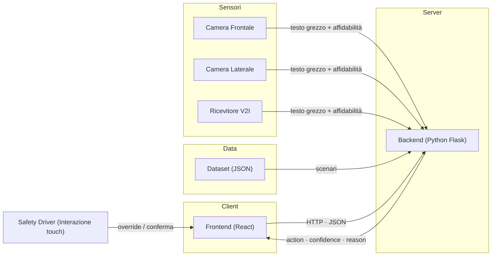

# V-Shuttle – Dashboard e Soluzione di Parsing per Navette Autonome

**Hackathon Pitch & Build – Hastega / Waymo LCC**  
Team: *TeamNumero1*  

---

## Descrizione del Progetto

Il problema affrontato riguarda le navette a guida autonoma **V-Shuttle** di Waymo LCC, che operano nei centri storici toscani. Il sistema attuale è estremamente sicuro ma troppo "timido": di fronte a cartelli stradali ambigui o degradati va in panico e blocca il veicolo, causando **Phantom Braking** e disagi ai passeggeri. Il safety driver (Marco) visualizza sul tablet solo log incomprensibili, perdendo secondi preziosi per riprendere il controllo.

La nostra soluzione introduce due componenti chiave:

1. **Parser Semantico** – Un algoritmo di fusione intelligente dei dati provenienti da tre sensori (telecamera frontale, telecamera laterale, ricevitore V2I) che normalizza il testo, interpreta il cartello (divieti, eccezioni, orari, festivi) e decide l’azione: `GO`, `STOP` o `REQUEST` (richiesta intervento umano).
2. **Dashboard Live** – Un’interfaccia touch pensata per il safety driver, essenziale e immediata, che mostra in modo chiaro l’azione intrapresa, il testo fuso, il livello di confidenza e richiede l’override con un timer di 2 secondi in caso di incertezza.

L’obiettivo è ridurre al minimo le frenate fantasma e restituire al conducente il controllo solo quando necessario, migliorando l’esperienza di guida e la sicurezza.

---

## Approccio e Filosofia di Design

Abbiamo adottato una metodologia **minimalista** (“less is more”) nella progettazione della dashboard. Poiché il safety driver deve mantenere l’attenzione sulla strada anche se la guida è autonoma, l’interfaccia:

- Mostra **solo le informazioni essenziali** (azione, confidenza, testo compreso, timer).
- Utilizza **colori psicologici** (verde = GO, rosso = STOP, giallo = richiesta).
- Presenta messaggi **in linguaggio naturale**, senza log tecnici.
- Ha pulsanti **grandi (“fat finger”)** per essere utilizzata su tablet in movimento.
- Si aggiorna automaticamente ogni 4 secondi, simulando il flusso continuo di scenari.

Sul backend, abbiamo implementato una logica **deterministica** (nessuna chiamata a LLM esterni) che gestisce l’incertezza, i sensori offline e le eccezioni come “Eccetto BUS”.

---

## Screenshot

> Acquisiti su iPad Pro per simulare il contesto reale di utilizzo da parte del safety driver.

<div align="center">

### Avvio Simulazione


<br/>

### Richiesta di Intervento (timer 2s)


<br/>

### Azione GO — Confidenza Alta


<br/>

### Azione STOP — Motivazione Chiara


</div>

## Demo Live

.gif?raw=true)  
*Esempio del flusso automatico con passaggio scenari ogni 4 secondi e gestione del timeout.*

---

## Mockup – Autista in azione

  
*Rappresentazione realistica del guidatore che interagisce con il tablet durante la guida.*

---

## Come Funziona

### 1. Fusione Intelligente dei Sensori

Il backend riceve un array di tre letture (testo grezzo) con i rispettivi livelli di affidabilità (telecamera frontale: alta, laterale: media, V2I: variabile). L’algoritmo:

- **Normalizza** ogni stringa correggendo errori OCR comuni (es. “D1V1ET0” → “DIVIETO”).
- **Pulisce** il testo (rimozione spazi, caratteri speciali, maiuscole).
- **Confronta** le letture pesate per affidabilità e sceglie il testo più probabile.
- Se due sensori sono in disaccordo e nessuno raggiunge una confidenza sufficiente, il sistema passa in stato `REQUEST`.

> *Per una descrizione dettagliata della formula matematica di fusione e della gestione dei casi limite, consulta il file [documentazione.md](./backend/documentazione.md).*

### 2. Parsing Semantico e Decisione

Una volta ottenuto il testo normalizzato, il parser:

- Riconosce il tipo di cartello (**divieto**, **obbligo**, **indicazione**).
- Applica le regole temporali (orari, giorni festivi) confrontando con l’orario dello scenario.
- Verifica la presenza di eccezioni come **“Eccetto BUS”** (forza GO).
- Calcola un **confidence level** finale basato sulla qualità della lettura e sulla complessità del cartello.

L’output è un JSON strutturato:

```json
{
  "action": "GO" | "STOP" | "REQUEST",
  "confidence": 0.95,
  "reason": "Stringa motivazionale in linguaggio naturale"
}
```

### 3. Interazione Client–Server

- **Client (Frontend)** → richiede l’avvio della simulazione.
- **Server (Backend)** → per ogni scenario del dataset, invia la decisione (action, confidence, reason) ogni 4 secondi.
- In caso di `REQUEST`, il frontend avvia un timer di 2 secondi; se l’autista non preme override, il sistema forza `STOP` e passa allo scenario successivo.

---

## Architettura del Sistema



| Componente | Responsabilità |
|:----------:|----------------|
| **Frontend** | Dashboard single-page, aggiornamento in tempo reale, gestione timer e override |
| **Backend** | API REST, fusione sensori, parsing semantico, decisione (`GO` / `STOP` / `REQUEST`) |
| **Dataset** | Scenari JSON con letture dei tre sensori e metadati temporali |

---

## Team di Sviluppo

| Ruolo                  | Nome                |
|------------------------|---------------------|
| **Backend & Docs**            | Gianmarco Venturini, Nicholas Tropea |
| **Frontend, Design & Docs**  | Samuele Vasta, Bruno Di Renzo        |


Tutti i membri hanno collaborato attivamente alla progettazione della logica di fusione e all’integrazione tra i componenti.

---

## Setup e Avvio

### Prerequisiti
- `make` (per i comandi di automatizzazione)
- Python 3.9+ (backend)
- Node.js 16+ (frontend)

### Installazione dipendenze
```bash
# Backend
make backend-install

# Frontend
make frontend-install
```

### Avvio dell’applicazione (due terminali separati)

**Terminale 1 (Backend)**
```bash
make backend-run-api
```

**Terminale 2 (Frontend)**
```bash
make frontend-run
```

---

## Struttura della Repository

```
V-Shuttle
├── 📁 backend                       # Logica di fusione sensori, parser e API
│   ├── 📁 data                      # Dataset JSON con scenari di test
│   ├── 📁 src                       # Codice sorgente del backend
│   ├── 📁 tests                     # Test unitari e di integrazione
│   └── 📄 documentazione.md         # Dettagli algoritmi 
├── 📁 frontend                      # Dashboard utente React
├── 📁 media                         # Immagini, GIF, mockup per il README
├── 📄 Makefile                      # Comandi automatizzati (setup, avvio)
└── 📄 README.md                     # Documentazione principale del progetto
```

---

## Test e Stress Test Finale

Il sistema è stato progettato per gestire senza crash i **30 scenari segreti** forniti a T-10 minuti dalla fine dell’hackathon. L’algoritmo deterministico e la pulizia delle stringhe garantiscono robustezza anche in presenza di errori OCR complessi.

---

**Grazie per l’attenzione!**  
*TeamNumero1 – Hastega Hackathon 2025*