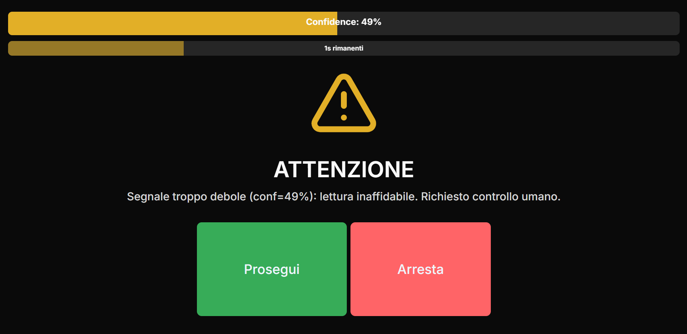
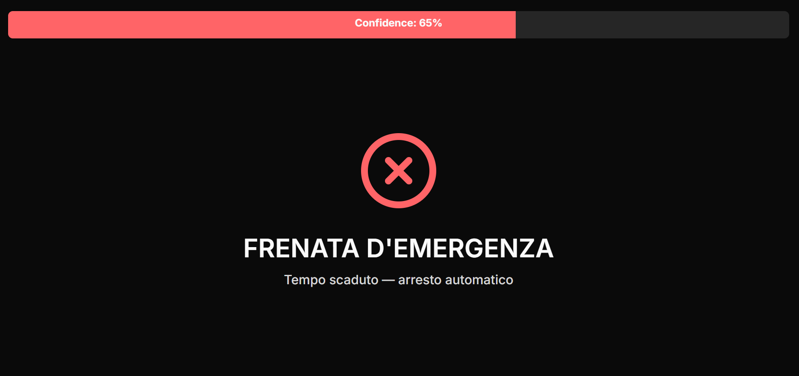

### How to run:

Terminal 1 (Backend):
```bash
make backend-run-api
```

Terminal 2 (Frontend):
```bash
make frontend-run
```

# V-Shuttle dashboard and parsing solution
Il nostro team ha sviluppato una soluzione al problema proposto da Waymo LCC.
Il sistema attuale si blocca alla minima incertezza sui segnali mostrati per ragioni di sicurezza ma cio' peggiorava l'esperienza di chi guida e (soprattutto) dei turisti della navetta!
Noi abbiamo sviluppato 2 sistemi in stretta comunicazione tra loro per risolvere questo problema.

## Parsing dei segnali
I sensori della navetta automatica analizzano l'ambiente intorno a loro e inviano segnali al nostro parser che li interpreta e fornisce una decisione su cosa fare con il veicolo, se fermarsi o continuare. Il nostro algoritmo infallibile analizza i cartelli e decide quale azione intraprendere con un certo "confidence level". Qualora questo dovesse essere troppo basso chiede all'autista se proseguire o fermare il veicolo. Se questo non dovesse rispondere allora, solo in questo caso, si procederebbe a fermare del tutto il veicolo per ragioni di sicurezza (da notare che questo era il comportamento di default nella maggior parte dei casi!).

### Spiegazione della fusione dei risultati dei sensori
Vedi file appropriato
## Dashboard
L'autista ha a disposizione un display su cui viene mostrato lo stato attuale del sistema e viene mostrato in maniera semplice e digestibile l'azione che sta venendo eseguita. La motivazione e' chiaramente spiegata a parole invece che con log incomprensibili di modo che l'autista possa valutare la situazione al meglio. Abbiamo posto particolare attenzione alla comunicazione delle informazioni di modo che non venga distratto da elementi inutili e venga mostrato tutto e solo il necessario.
# Spiegazione interazione client-server
Client -> Server:
- Richiesta inizio simulazione

Server -> Client:
  - Decisione dati i risultati dei sensori
  - Risposta: array contenente oggetti di tipo
      
      {
        "action": "GO" | "STOP" | "REQUEST",
        "confidence": float,
        "reason": "Stringa con le motivazioni"
    }
# Informazioni aggiuntive
La repository e' divisa in cartelle per facilitare la navigazione, informazioni aggiuntive sono presenti in vari readme posti in modo da facilitare la comprensione.
